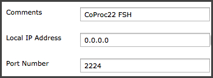
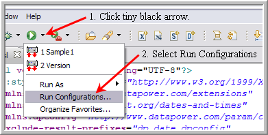
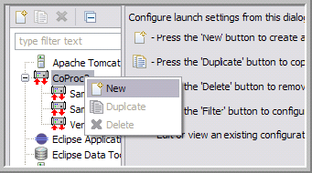
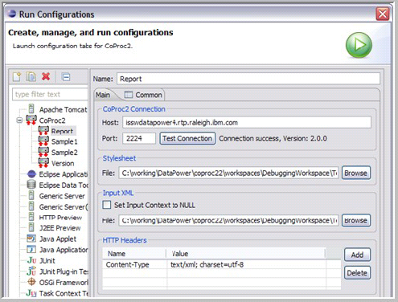
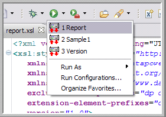
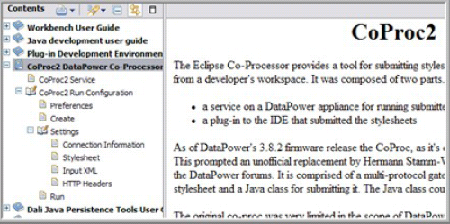
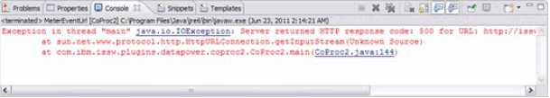

CoProc2 Eclipse Plugin
=======================

CoProc2 is a DataPower developer utility used to execute XSLT stylesheets
on a remote DataPower appliance.  Most IDEs support running XSLT locally.
But few IDEs provide an XSLT runtime environment that supports the
DataPower extension APIs that are pervasive in most DataPower stylesheets.
CoProc2 submits a developer's stylesheet, together with any XML input or
HTTP headers, to a MPGW service proxy running on the DataPower
appliance.  The service proxy executes the stylesheet against any input.
The results are returned in the response.

The **CoProc2 Eclipse Plugin** wraps the CoProc2 Java class inspired by 
[Hermann's BLOG Post](https://www.ibm.com/developerworks/mydeveloperworks/blogs/HermannSW/entry/coproc2_again_integration_in_eclipse44?lang=en).
The wrapper takes the form of an **Eclipse Run Configuration**,
which is the mechanism we use in Eclipse to run other Java-based
actions such as run a stand-alone Java program, an application
test environment, an applet, or a JUnit test.  In this case,
the configuration panel is oriented to running CoProc2.

In order to use the latest version of the CoProc2 plug-in, you
have to use the MPGW that corresponds to it.  You can download
this along with an *CoProc2 Installation Guide* from [Paul Glezen's
Homepage](http://glezen.org/).  Detailed documentation is included
with the plugin.

## Installation ##

There are two components to install:

* the MPGW service on the DataPower appliance
* the Eclipse plugin into the Eclipse workspace

It's important that the two components are compatible.

### Service Installation ###

The service export can be obtained from

http://glezen.org/update/coproc2-2/CoProc22.zip

Designate an application domain in your target DataPower appliance for
running the `coproc22` MPGW.  The target appliance should be one
used for development purposes, not production.  A typical practice is to
create an application domain named **Utilities** and import the `CoProc22.zip`
there.

Once the service proxy is imported, edit the HTTP FSH named **coproc22**.
Change the **Local IP Address** and **Port Number** to something suitable
for your environment.



It's recommended that you **not** listen on `0.0.0.0` like the example above;
instead it's safer to choose a particular interface allocated to development
traffic.  The port number may be any port you like.  You may verify the
installation with the cURL command as in the following example.

```
$ curl http://192.168.152.12:2224/coproc/version
Version: 2.0.0
Date: May 21, 2011
```

### Plugin Installation ###

Currently the plugin requires Eclipse 3.6 or later.  Since the point of the plugin is
to assist with XSLT development, it's best to have the Web Tools Platform (WTP)
installed since this provides the Eclipse XSLT support.  Start Eclipse and follow
these steps to install the CoProc2 plugin.

1. Select **Help &rarr; Install New Software ...**.

2. Click the **Add** button next to the **Work with** field.
    This displays the **Add Repository** dialog.

3. Enter `CoProc2` for the **Name** field.  For **Location**, enter
    `http://glezen.org/update/coproc202`.

4. Click **OK** so that the CoProc2-2 update site is chosen.
    Select the CoProc2 plugin as shown below.

    

5. Click **Next**.

6. Continue clicking **Next** through the information panels and license acceptance.

7. Click **Finish** at the end.  Since this plugin is not signed with a digital
    signature, you can expect to see a security warning about unsigned content.
    Click **OK**.

8. Restart Eclipse after the plugin installation in complete.

This completes the plugin installation.
As a verification, you can select **Help &rarr; About Eclipse**.
You should see an entry for the CoProc2 as shown in the figure below.


## Overview ##

CoProc2 is a DataPower service together with an Eclipse plugin.
The plugin submits a stylesheet together with its input to the CoProc2
service for processing and displays the results to the Eclipse
console.  In the following example, the stylesheet `report.xsl` processes
the XML file `report.xml`.

1. Open the **Run Configurations** view as shown below.

    

2. Right-click the **CoProc2** type and select **New**.

    

3. Name the configuration `Report`.

4. Click **Test Connection** to ensure we can each CoProc2 service
    on the DataPower appliance.

5. Enter the stylesheet information through the **Browse** button.

6. Uncheck **Set Input Context to NULL** since we have input.

7. Enter the input XML file through the **Browse** button.

8. Click **Apply**.

9. Click **Run**.

    

The console window contains the output from the transform.
Running the configuration creates a Run short-cut that may be
used for subsequent runs.
First click the tiny black down-arrow next to the green run icon,
then select **Report** from the list.
The run configuration dialog isn't needed again unless the input
or headers need to be changed.



## Documentation ##

The plugin configuration steps are documented in the Eclipse
help section.



## Troubleshooting ##

### Connection Problems ###

HTTP proxy support has not yet been incorporated into the remote
execution of the stylesheet.
If you are working at a location that requires an outbound proxy
configuration, the remote execution will fail.
The **Test Connection** button will succeed because it inherits the
proxy configuration of the Eclipse workbench (which is configured
through the Eclipse preferences under **General &rarr; Network
Connections**.  However the remote invocation of the stylesheet
spawns a separate JVM that does not inherit the settings.

### HTTP 500 Returned ###

If a stylesheet causes an HTTP 500 returned, the only indication is
the Eclipse console output is an ugly message like the following.



In this example, the stylesheet's `<reject/>` tag executed, aborting
the rule (which was actually the desired behavior).
Be sure to follow up your remote stylesheet execution by checking
the DataPower logs of the application domain in which the CoProc2
service is deployed.

 


